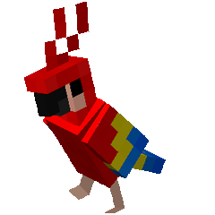
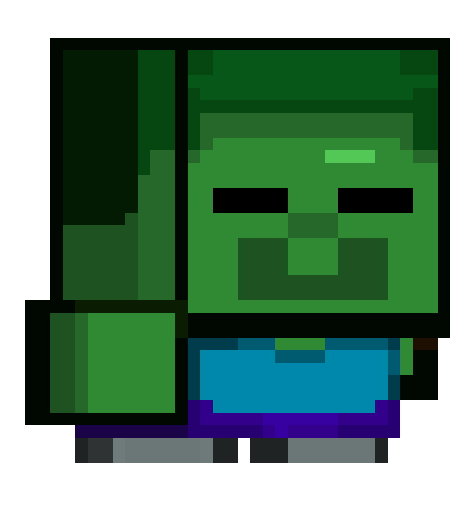

  

  

  
  
  
  
  

<table align="center" border="0" cellspacing="0" cellpadding="0" style="border:none; border-collapse:collapse;">
  <tr>
    <td align="left" width="40%" valign="middle" style="border:none;">
      
    </td>
    <td align="left" width="60%" valign="middle" style="border:none;">
      

        I’m 23 years old and a Systems Engineering graduate from Universidad Cooperativa de Colombia.
      

      

        Software development is one of my biggest passions, especially frontend and backend engineering. Building useful, creative, and practical projects that solve real-world problems is something I genuinely enjoy.
      

      

        Quick to adapt and easy to teach, I like writing clean code, improving solutions, and using vibe coding to prototype ideas faster and more effectively.
      

      

        Being part of research groups also helped strengthen analytical thinking, teamwork, and discipline.
      

      

        Beyond tech, studying, playing video games, editing content, and streaming are all part of what I enjoy most.
      

      

        Committed, curious, and always aiming to grow, continuous learning is a key part of who I am.
      

    </td>
  </tr>
</table>

  

  

<h3 align="left">Languages</h3>

  

<h3 align="left">Frontend</h3>

  

<h3 align="left">Backend and Runtime</h3>

  

<h3 align="left">Databases</h3>

  
  
  

<h3 align="left">Data Science and Technical Documentation</h3>

  
  

<h3 align="left">AI Tools</h3>

  
  
  
  

<h3 align="left">Development Tools</h3>

  

<h3 align="left">IDEs and Platforms</h3>

  

<h3 align="left">Design and Creativity</h3>

  

  

  

Video editing, streaming, video games, anime, and digital content creation are a big part of my personal world. I enjoy exploring new creative ideas, improving the quality of my content, and learning how to communicate better through visual and digital media. I also like discovering new tools, platforms, and trends that help me grow both creatively and technically. These interests keep me inspired, help me stay consistent, and give me new ways to express my personality outside of academic and professional work.

  

  

Spanish: Native  
English: A1

  

  

<table align="center" border="0" cellspacing="0" cellpadding="0" style="border:none; border-collapse:collapse;">
  <tr>
    <td align="center" width="170" style="border:none; vertical-align:top;">
      
        
      
        
      Hospital management
    </td>
    <td align="center" width="170" style="border:none; vertical-align:top;">
      
        
      
        
      Nature and species
    </td>
    <td align="center" width="170" style="border:none; vertical-align:top;">
      
        
      
        
      AI / NLP
    </td>
    <td align="center" width="170" style="border:none; vertical-align:top;">
      
        
      
        
      Learning and practice
    </td>
  </tr>
</table>

  

  

<table align="center" border="0" cellspacing="0" cellpadding="0" style="border:none; border-collapse:collapse;">
  <tr>
    <td align="center" width="45%" style="border:none;">
      
    </td>
    <td align="center" width="45%" style="border:none;">
      
    </td>
  </tr>
</table>

  

  

<table align="center" border="0" cellspacing="0" cellpadding="0" style="border:none; border-collapse:collapse; width:100%; max-width:900px;">
  <tr>
    <td align="center" width="28%" valign="middle" style="border:none; padding:10px;">
      
        
      
    </td>
    <td align="left" width="72%" valign="middle" style="border:none; padding:10px;">
      

        Systems Engineering graduate - Universidad Cooperativa de Colombia, expected 2026.
      

      

        Academic High School Graduate (2020) - Colegio Vista Bella IED.
      

      

        Research experience: XXI Regional Meeting of Research Seedbeds (REDCOLSI, 2024).
      

      

        Research experience: XXVIII National and XXII International Meeting of Research Seedbeds, ENISI 2025 (REDCOLSI).
      

      

        My academic journey has strengthened my technical foundation, problem-solving skills, research mindset, and commitment to continuous improvement.
      

    </td>
  </tr>
</table>

  

  

- Personal Development G4 - UNO (2022)
- Beginner Programming G4 - ONE (2023)
- Business Agility G4 - UNO (2023)
- HTML & CSS (2023)
- Oracle Next Education F2 T4 Front-End (2023)
- Problem-Solving & Decision-Making (2024)
- JavaScript Programming - GeneracionTIC (50 hours, 2024)
- Cybersecurity - GeneracionTIC (50 hours, 2024)
- Online English Learning Strategies (2024)
- NDG Linux Unhatched - Cisco Networking Academy (2024)

I also have many more certifications that are not listed here yet.

  
   
  

  

  

  
  
  
  
  
  
  

  
    
  
    
  
    
  
  
    
  <strong>See you in the next project.</strong>
    
  

