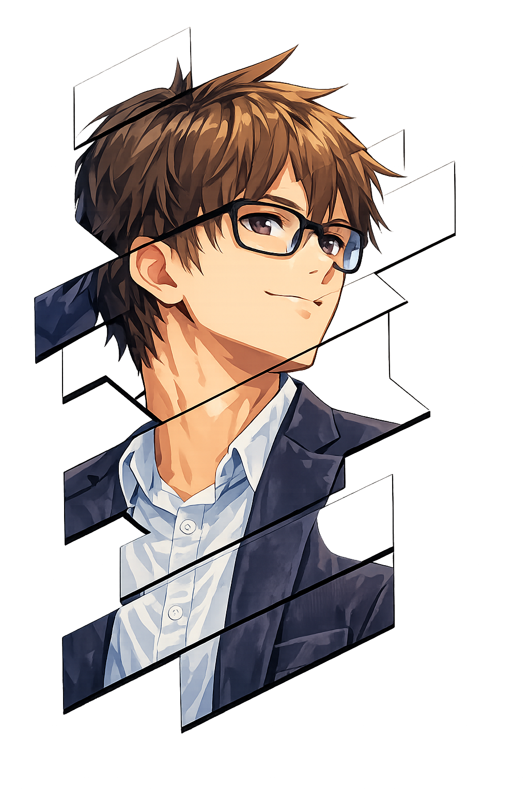

  

---

  

<table align="center" border="0" cellspacing="0" cellpadding="0" style="border:none; border-collapse:collapse;">
  <tr>
    <td align="left" width="40%" valign="middle" style="border:none;">
      
    </td>
    <td align="left" width="60%" valign="middle" style="border:none;">
      

        Tengo 23 años y soy ingeniero de sistemas de la Universidad Cooperativa de Colombia.
      

      

        Me apasiona el desarrollo de software, especialmente frontend y backend, y disfruto crear proyectos útiles, divertidos y enfocados en resolver problemas reales.
      

      

        Me adapto rápido, aprendo con facilidad y disfruto escribir código ordenado, mejorar mis soluciones y usar Vibe Coding para prototipar ideas con más agilidad.
      

      

        He participado en grupos de investigación, lo que fortaleció mi pensamiento analítico, el trabajo en equipo y la disciplina.
      

      

        También me gusta estudiar, jugar videojuegos, editar contenido y hacer streams.
      

      

        Soy una persona comprometida, curiosa y orientada al aprendizaje continuo.
      

    </td>
  </tr>
</table>

  

  

<h3 align="left">Lenguajes</h3>

  

<h3 align="left">Frontend</h3>

  

<h3 align="left">Backend y Runtime</h3>

  

<h3 align="left">Base de Datos</h3>

  
  
  

<h3 align="left">Ciencia de Datos y Documentacion Tecnica</h3>

  
  

<h3 align="left">AI Tools</h3>

  
  
  
  

<h3 align="left">Herramientas de Desarrollo</h3>

  

<h3 align="left">IDEs y Plataformas</h3>

  

<h3 align="left">Diseno y Creatividad</h3>

  

  

  

Edicion de video, streaming, videojuegos, anime y creacion de contenido digital.

  

  

Espanol: nativo.  
Ingles: en aprendizaje continuo con enfoque tecnico.

  

  

<table align="left" border="0" cellspacing="0" cellpadding="0" style="border:none; border-collapse:collapse;">
  <tr>
    <td align="center" width="220" style="border:none;">
      
        
      
        
      Proyecto de gestion hospitalaria
    </td>
    <td align="center" width="220" style="border:none;">
      
        
      
        
      Proyecto tematico de naturaleza y especies
    </td>
  </tr>

  <tr>
    <td align="center" width="220" style="border:none;">
      
        
      
        
      Repositorio relacionado con IA / NLP
    </td>
    <td align="center" width="220" style="border:none;">
      
        
      
        
      Repositorio de aprendizaje y practica
    </td>
  </tr>
</table>

  

  

<table align="center" border="0" cellspacing="0" cellpadding="0" style="border:none; border-collapse:collapse;">
  <tr>
    <td align="center" width="45%" style="border:none;">
      
    </td>
    <td align="center" width="45%" style="border:none;">
      
    </td>
  </tr>
</table>

  

  

Systems Engineer - Universidad Cooperativa de Colombia  
Academic High School Graduate (2020) - Colegio Vista Bella IED

  

  

  
<strong>Ver certificaciones</strong>

   

- Personal Development G4 - UNO (2022)
- Beginner Programming G4 - ONE (2023)
- Business Agility G4 - UNO (2023)
- HTML & CSS (2023)
- Oracle Next Education F2 T4 Front-End (2023)
- Problem-Solving & Decision-Making (2024)
- JavaScript Programming - GeneracionTIC (50 horas, 2024)
- Cybersecurity - GeneracionTIC (50 horas, 2024)
- Online English Learning Strategies (2024)
- NDG Linux Unhatched - Cisco Networking Academy (2024)

  

  

  
  
  
  
  
  
  

  

### Thanks for visiting my profile

